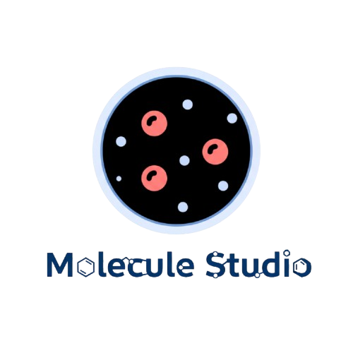

# Molecule-Studio

Molecule-Studio is a web-based 3D molecule visualizer built with React and Three.js. It allows users to search for molecules and view their structures in an interactive 3D environment.



## Features

- **3D Molecule Rendering:** View molecular structures rendered in a 3D space.
- **Interactive Controls:** Rotate, pan, and zoom the view using OrbitControls.
- **Search Functionality:** Load different molecules by name (e.g., `water`, `caffeine`, `methane`).
- **CPK Coloring:** Atoms are colored according to the standard CPK (Corey-Pauling-Koltun) convention for easy identification.

## Tech Stack

- **Framework:** React (with TypeScript)
- **Build Tool:** Vite
- **3D Rendering:** `three.js`
- **Styling:** Bootstrap

## Getting Started

To get a local copy up and running, follow these simple steps.

### Prerequisites

- Node.js (v18 or later)
- npm

### Installation

1. Clone the repo:
   ```sh
   git clone https://github.com/your_username/molecule-studio.git
   ```
2. Navigate to the project directory:
   ```sh
   cd molecule-studio
   ```
3. Install NPM packages:
   ```sh
   npm install
   ```

### Running the Application

To run the app in development mode, execute:
```sh
npm run dev
```
Open [http://localhost:5173](http://localhost:5173) (or the port shown in your terminal) to view it in the browser.

## Available Scripts

In the project directory, you can run:

- `npm run dev`: Runs the app in development mode.
- `npm run build`: Builds the app for production.
- `npm run lint`: Lints the codebase using ESLint.
- `npm run preview`: Serves the production build locally for preview.